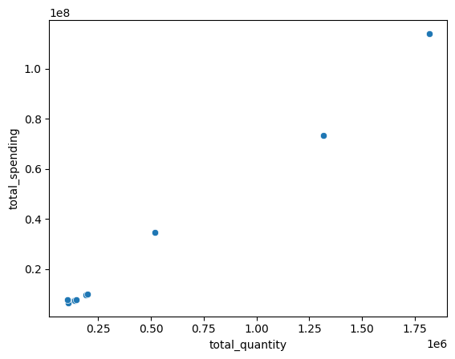
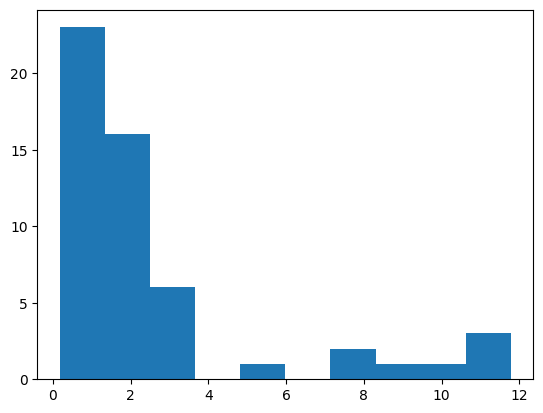
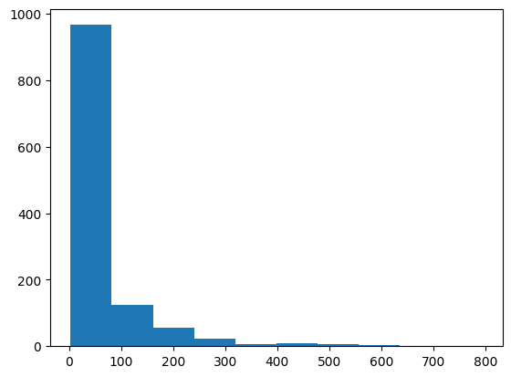
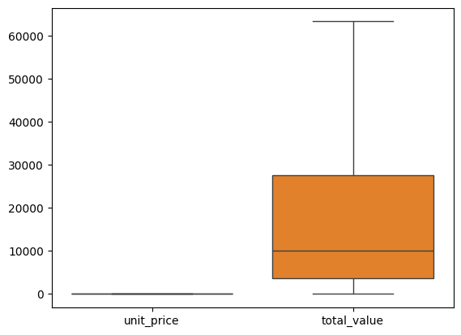
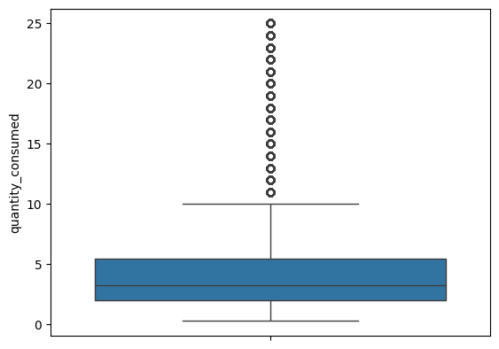

# to create environment 
python -m venv hospital
 
# To activate it
hospital\Scripts\activate

# Hospital Analytics

## Business Problem  
Hospital administrators lack a unified view of **clinical**, **financial**, and **pharmacy operational KPIs** due to siloed data systems.  
This fragmentation leads to:  
- Delayed decision-making  
- Inefficient resource allocation  
- Reduced service quality  
- Limited ability to proactively monitor performance or forecast demand across hospital units  

---

## Business Objective  
- **Maximize:** Real-time operational visibility  
- **Minimize:** Decision-making delays  

---

## Business Constraints  
- **Maximize:** System interoperability requirements  
- **Minimize:** Data integration complexity  

---

## Success Criteria  
- **Business Success Criteria:**  
  - All 3 core departments (Clinical, Financial, Pharmacy) have functional dashboards with real-time KPI access  

- **Economic Success Criteria:**  
  - At least **30% reduction in manual reporting time**, translating to cost savings in administrative overhead  .

## Enhanced Analytics – Hospital Data Sets

## 📌 Project Overview
Hospital administrators face challenges in decision-making due to fragmented data across clinical, financial, and operational systems.  
This project focuses on **exploratory data analysis (EDA)** and **data preprocessing** for key financial metrics, providing statistical insights and visualizations for better hospital resource monitoring.

---

## 📊 Columns Used
1. **total_spending** – Total expenditure of hospital units.  
2. **total_quantity** – Total quantity of resources/medicines utilized.  
3. **transaction_count** – Number of transactions recorded.  
4. **revenue_lost** – Estimated revenue lost due to inefficiencies.  

---

## 🔎 Exploratory Data Analysis (Before Preprocessing)

### **First Business Moment (Central Tendency)**
**total_spending**  
- Mean = 27,831,281.20  
- Median = 8,706,416.01  
- Mode ≈ 6.49M  
- Sample values: 7.23M, 7.40M, 7.76M, 7.80M, 9.60M, 9.99M, 34.44M, 73.47M, 114.09M  

**Insight:**  
The data shows a **right-skewed distribution** where most units spend around **6–10M**, but a few extreme outliers (34M–114M) raise the mean far above the median.

### **Second Business Moment (Dispersion)**
**total_spending**  
- Std. Dev = 36,997,121.14  
- Variance = 1.37e+15  
- Range = 107,604,772.91  

**Insight:**  
The data has **very high variability**, with a wide range (~107.6M) and large std (~37M), confirming extreme outliers that make spending highly dispersed.

### **Third Business Moment (Skewness)**
**total_spending**  
- Skewness = 1.87  

**Insight:**  
The skewness of **1.87** indicates a **strong right skew**, meaning a few very high spenders pull the distribution’s tail to the right.

### **Fourth Business Moment (Kurtosis)**
**total_spending**  
- Kurtosis = 2.74  

**Insight:**  
The kurtosis of **2.74** suggests a distribution that is **moderately peaked** with lighter tails than a normal distribution, indicating some outliers but not extreme heavy-tailed behavior.
## 📈 Univariate Analysis
      total_spending 
1. **Bar Plot** – Distribution of spending.  
     
    statistical insights =The bar plot shows most hospitals spend around 6–10M, while a few extreme outliers drive up overall spending.

2. **Histogram** – Frequency distribution.  
    
   statistical insights=The histogram shows most spending values fall in the 6–10M range, with fewer but significant extreme values creating a long right tail. 

3. **Density Plot** – Probability distribution.  
    
   statistical insights=The density plot shows a peak around 6–10M, tapering off with a long right tail due to a few high spenders. 

4. **Box Plot** – Detection of outliers.  
     
   ✔ statistical insights = Outliers are present.  
## 🔗 Bivariate Analysis
1. **Scatter Plot** – Relationship between spending and other variables.  
     

2. **Heatmap** – Correlation among variables.  
     

   

## 🔎 First Business Moment (Central Tendency)

**total_quantity**  
- Mean = **466,949.68**  
- Median = **167,605.67**  
- Mode ≈ **104,149.17 – 137,674.89** (most frequent range)  
- Sample values: 144,844.30 | 190,367.04 | 518,577.40 | 1,315,633.17 | 1,817,961.02  

**Insight:**  
The mean is **much higher than the median**, indicating a **right-skewed distribution**, where most hospitals consume moderate quantities, but a few consume extremely high quantities.
## 🔎 Second Business Moment (Dispersion)

**total_quantity**  
- Standard Deviation = **603,725.06**  
- Variance = **3.64e+11**  
- Range = **1,713,811.85**  

**Insight:**  
The very high **standard deviation and range** show **significant variability**, with a few hospitals consuming far more than the majority.
## 🔎 Third Business Moment (Skewness)

**total_quantity**  
- Skewness = **1.79**  

**Insight:**  
The distribution is **positively skewed**, confirming that a small number of hospitals record disproportionately high quantities.
## 🔎 Fourth Business Moment (Kurtosis)

**total_quantity**  
- Kurtosis = **2.12**  

**Insight:**  
The distribution is **moderately peaked** with lighter tails compared to normal, showing some outliers but not extreme heavy-tailed behavior.
## 📈 Univariate Analysis

1. **Bar Plot**  
     
   *Most hospitals fall in the lower-to-mid range, with few outliers at high values.*  

2. **Histogram**  
     
   *Shows concentration in the lower range and a long right tail.*  

3. **Density Plot**  
     
   *Peaks in moderate quantities, tapering off due to few extreme consumers.*  

4. **Box Plot**  
     
   ✔ Outliers are clearly present in the higher range.  
## 🔗 Bivariate Analysis

- **Scatter Plot**  
    
  *Displays relationships of `total_quantity` with other variables, showing clusters with some extreme outliers.*  

---

---

## 🔎 First Business Moment (Central Tendency)

**transaction_count**  
- Mean = **109,211.9**  
- Median = **33,710.0**  
- Mode ≈ **31,687 – 34,339** (most frequent range)  
- Sample values: 164,689 | 272,621 | 424,113  

**Insight:**  
The mean is much higher than the median, indicating a **right-skewed distribution** where most hospitals have relatively low transaction counts, while a few have extremely high counts.

---

## 🔎 Second Business Moment (Dispersion)

- Standard Deviation = **137,296.89**  
- Variance = **1.88e+10**  
- Range = **392,426**  

**Insight:**  
The large spread confirms **high variability**, with a wide gap between the lowest and highest transaction counts.

---

## 🔎 Third Business Moment (Skewness)

- Skewness = **1.75**  

**Insight:**  
The distribution is **positively skewed**, meaning most hospitals fall in lower transaction counts, while a few outliers significantly raise the average.

---

## 🔎 Fourth Business Moment (Kurtosis)

- Kurtosis = **2.29**  

**Insight:**  
The distribution is **moderately peaked**, with some outliers present but not extremely heavy-tailed.

---

## 📈 Univariate Analysis

1. **Bar Plot**  
     
   *Most hospitals cluster at lower transaction counts with fewer high values.*  

2. **Histogram**  
     
   *Shows concentration at lower ranges and a long right tail.*  

3. **Density Plot**  
     
   *Peaks at lower values, tapering off gradually due to a few high-transaction hospitals.*  

4. **Box Plot**  
     
   ✔ Outliers are clearly visible at higher transaction counts.  

## 🔗 Bivariate Analysis

- **Scatter Plot**  
    
  *Shows relationships of `transaction_count` with other features, highlighting clusters and extreme outliers.*  

## 🔎 First Business Moment (Central Tendency)

**revenue_lost**  
- Mean = **3,398,097.32**  
- Median = **805,641.69**  
- Mode ≈ **495,497 – 973,470** (most frequent range)  
- Sample values: 1,041,587.74 | 9,708,921.67 | 18,153,508.47  

**Insight:**  
The mean is far higher than the median, showing a **strong right-skewed distribution**, where most hospitals lose less than 1M but a few incur very high revenue losses.

---

## 🔎 Second Business Moment (Dispersion)

- Standard Deviation = **5,899,758.59**  
- Variance = **3.48e+13**  
- Range = **17,658,011.30**  

**Insight:**  
The data has **very high variability**, meaning revenue losses differ greatly between hospitals, with extreme outliers driving the spread.

---

## 🔎 Third Business Moment (Skewness)

- Skewness = **2.24**  

**Insight:**  
The distribution is **highly positively skewed**, confirming that a small number of hospitals suffer disproportionately high revenue losses.

---

## 🔎 Fourth Business Moment (Kurtosis)

- Kurtosis = **4.56**  

**Insight:**  
The distribution is **leptokurtic (heavy-tailed)**, indicating strong peaks and extreme outliers, with high revenue losses occurring in a few cases.

---

## 📈 Univariate Analysis

1. **Bar Plot**  
     
   *Most hospitals report smaller losses, with a few extreme cases at the high end.*  

2. **Histogram**  
     
   *Shows concentration of values below 1M, with a long right tail.*  

3. **Density Plot**  
     
   *Peak in low-loss range, tapering gradually with few large-loss hospitals.*  

4. **Box Plot**  
     
   ✔ Outliers are clearly present in the higher range.  

---

## 🔗 Bivariate Analysis

- **Scatter Plot**  
    
  *Reveals clusters of hospitals with low revenue losses and a few extreme outliers far above the rest.*  

---

## 🛠 Data Preprocessing(data_set -1)

1. **Duplicates Handling** – No duplicates found.  
2. **Missing Values** – No missing values detected.  
3. **Outliers** – Outliers were removed from data set. 

### **After data Preprocessing**
-  – Distribution after removing outliers.  
    

**Insight:**  
After preprocessing, the **outliers are removed**, resulting in a cleaner and more reliable dataset for further analysis and modeling. 
### 📌 Business Insights
- After removing outliers, **spending distribution is more balanced**, showing the true typical range of hospital expenditures.  
- Most hospitals now fall within a **moderate, consistent spending band**, improving reliability of benchmarks.  
- The absence of extreme values makes the **mean and median closer**, giving a clearer picture of average spending behavior.  
- This cleaned view allows administrators to **set realistic budgets, detect abnormal patterns quickly, and allocate resources more effectively**.  

# Enhanced Hospital Dataset (Vendors) - Analysis

## Dataset used
This analysis focuses on the **Enhanced Hospital Dataset (Vendors)**. The following columns were primarily used for the analysis:  

1. `average_lead_time_days`  
2. `market_share_percent`  
3. `fill_rate_percentage`  

---

## 1. Average Lead Time (Days)

### First Business Moment (Central Tendency)
- **Mean:** 18.70  
- **Median:** 16.0  
- **Mode:** 0, 13  

### Second Business Moment (Spread of Data)
- **Variance:** 8.97  
- **Standard Deviation:** 80.48  
- **Range:** 35  

### Third Business Moment (Skewness)
- **Skew:** 0.965  

### Fourth Business Moment (Kurtosis)
- **Kurtosis:** -0.114  

### Univariate Analysis
- **Histogram:**   
- **Density Plot:**   
- **Boxplot:**   

### Bivariate Analysis
- **Scatter Plot:**   
- **Heat Map:**   

---

## 2. Market Share Percentage

### First Business Moment (Central Tendency)
- **Mean:** 2.49  
- **Median:** 1.6  
- **Mode:** 0 = 0.18, 1 = 0.68  

### Second Business Moment (Spread of Data)
- **Variance:** 3.11  
- **Standard Deviation:** 9.69  
- **Range:** 11.6  

### Third Business Moment (Skewness)
- **Skew:** 2.004  

### Fourth Business Moment (Kurtosis)
- **Kurtosis:** 2.997  

### Univariate Analysis
- **Histogram:**   
- **Density Plot:**   
- **Boxplot:**   

### Bivariate Analysis
- **Scatter Plot:**   

---

## 3. Fill Rate Percentage

### First Business Moment (Central Tendency)
- **Mean:** 84.56  
- **Median:** 89.2  
- **Mode:** 89.2 (Multiple modes: 70.6, 74.2, 89.7, 91.8, 92.4, 94.1, 94.3, 96.1)  

### Second Business Moment (Spread of Data)
- **Variance:** 10.20  
- **Standard Deviation:** 103.99  
- **Range:** 37.8  

### Third Business Moment (Skewness)
- **Skew:** -0.597  

### Fourth Business Moment (Kurtosis)
- **Kurtosis:** 2.997  

### Univariate Analysis
- **Histogram:**   
- **Density Plot:**   
- **Boxplot:**   

---
# Data Preprocessing
1. **Duplicate Handling:** No duplicates were found, ensuring each record represents a unique vendor entry.  
2. **Missing Values:** Dataset is complete with no missing values, allowing accurate analysis.  
3. **Outlier Analysis:** Outliers in lead time and fill rate were removed to improve reliability of statistical measures and visualizations.  

### After Data Preprocessing
  

**Insights:**  
- Data is clean and ready for analysis, enabling more reliable decision-making.  
- Outlier removal aligns the mean and median closer to typical values, reducing bias.  
- Hospital administrators can now confidently benchmark vendor performance and identify areas for operational improvement.

## Statistical Insights

1. **Average Lead Time Days**  
   - Mean = 18.7, Median = 16 → Right-skewed distribution (skew = 0.965).  
   - Suggests some vendors have much higher lead times than typical.  

2. **Market Share Percentage**  
   - Highly positively skewed (skew = 2.004), with a few vendors holding majority market share.  
   - Median = 1.6, Mean = 2.49 → Most vendors have small market share.  

3. **Fill Rate Percentage**  
   - Slightly negatively skewed (skew = -0.597), indicating majority of vendors have high fill rates.  
   - Variance = 10.20, Std Dev = 103.99 → Wide spread before outlier removal.  

4. **Outlier Impact**  
   - Outliers in lead time and fill rate were removed, which brought mean and median closer and improved reliability of analysis.  

5. **Kurtosis Observations**  
   - Lead Time kurtosis = -0.114 → Slightly flatter than normal distribution.  
   - Market Share kurtosis = 2.997 → Heavy-tailed distribution, highlighting dominance by few vendors.  

---

## Business Insights

1. **High Lead Time Vendors**  
   - Vendors with very high lead times are slowing overall supply chain efficiency. Focused monitoring and performance improvement is needed.  

2. **Market Concentration**  
   - A few vendors dominate the market share. Diversifying vendor base could reduce risk and increase competition.  

3. **Fill Rate Strength**  
   - Most vendors maintain high fill rates (>85%), ensuring hospital operations are rarely disrupted.  

4. **Support Low-performing Vendors**  
   - Vendors with low fill rates (70–75%) need operational support to meet hospital demand consistently.  

5. **Predictive Opportunity**  
   - The cleaned dataset allows hospital administrators to use predictive analytics for demand forecasting, vendor performance monitoring, and optimizing procurement cycles.

# Enhanced Inventory Analysis (Dataset_3)

## Columns Used
- **current_stock**
- **max_stock_level**
- **stock_value**
- **turnover_rate**

---

## EDA on `current_stock`

### First Business Moment (Central Tendency)
- **Mean:** 42.86  
- **Median:** 43.48  
- **Mode:** 13.41, 15.17, 35.44, 36.19, 51.34  

**Insights:**  
- Mean and median are close, indicating a fairly symmetric distribution.  
- Multiple modes suggest clusters of commonly occurring stock levels.  

---

### Second Business Moment (Spread of Data)
- **Standard Deviation:** 22.07  
- **Variance:** 486.99  
- **Range:** 74.93  

**Insights:**  
- Wide spread indicates significant variation in stock levels.  
- Some items are stocked in very high quantities compared to others.  

---

### Third Business Moment (Skewness)
- **Skewness:** -0.035  

**Insights:**  
- Skewness is nearly zero, suggesting an almost symmetric distribution.  
- Stock values are balanced around the mean with no extreme left or right tail.  

---

### Fourth Business Moment (Kurtosis)
- **Kurtosis:** -1.21  

**Insights:**  
- Distribution is **platykurtic** (flatter than normal).  
- Fewer extreme outliers and a wider spread around the mean.  

---

## Univariate Analysis

### Histogram
  

**Insights:**  
- Stock levels are distributed across a wide range.  
- No strong skew; the distribution is relatively balanced.  

---

### Boxplot
  

**Insights:**  
- Data shows moderate spread with some potential mild outliers.  
- Median lies near the center, confirming balanced distribution.  

---

## Bivariate Analysis

### Scatter Plot
  

**Insights:**  
- Scatter plot indicates relationships between stock and other factors (e.g., max stock or turnover).  
- No extreme clustering, suggesting stable inventory management across products.  

---

## EDA on `max_stock_level`

### First Business Moment (Central Tendency)
- **Mean:** 373.10  
- **Median:** 268.66  
- **Mode:** 68.85, 73.41, 131.97, 162.80, 188.71, 262.51  

**Insights:**  
- Mean is much higher than the median, suggesting right-skewed distribution.  
- Multiple modes indicate several common maximum stock thresholds used in inventory planning.  

---

### Second Business Moment (Spread of Data)
- **Standard Deviation:** 320.11  
- **Variance:** 102,471.82  
- **Range:** 2086.14  

**Insights:**  
- Very high spread and large range indicate significant variation across items.  
- Some items are allowed extremely high maximum stock limits compared to the majority.  

---

### Third Business Moment (Skewness)
- **Skewness:** 1.63  

**Insights:**  
- Strong **positive skew** (right-skewed).  
- A few products have disproportionately high maximum stock levels, pulling the mean upward.  

---

### Fourth Business Moment (Kurtosis)
- **Kurtosis:** 3.11  

**Insights:**  
- **Leptokurtic distribution** (sharper peak and heavier tails than normal).  
- Indicates higher chances of extreme stock level values/outliers.  

---

## Univariate Analysis

### Histogram
  

**Insights:**  
- Distribution shows a long right tail.  
- Majority of items fall in lower to mid-level max stock ranges, while few items push the upper limit.  

---

### Boxplot
  

**Insights:**  
- Boxplot confirms presence of outliers on the higher side.  
- Median lies in the lower half, reinforcing positive skewness.  

---

## EDA on `stock_value`

### First Business Moment (Central Tendency)
- **Mean:** 2455.55  
- **Median:** 1521.29  
- **Mode:** 1162.05  

**Insights:**  
- Mean is much higher than the median, indicating a strong right skew.  
- Most stock values are concentrated around lower ranges, with few very high-value items pulling up the average.  

---

### Second Business Moment (Spread of Data)
- **Standard Deviation:** 2863.47  
- **Variance:** 8,199,472.79  
- **Range:** 21,234.12  

**Insights:**  
- Extremely wide spread, confirming high variability in stock values.  
- Some items have exceptionally high stock value compared to the majority.  

---

### Third Business Moment (Skewness)
- **Skewness:** 2.55  

**Insights:**  
- Strong **positive skew**.  
- A small number of items with very high stock values heavily influence the distribution.  

---

### Fourth Business Moment (Kurtosis)
- **Kurtosis:** 8.06  

**Insights:**  
- **Leptokurtic distribution** (very peaked with heavy tails).  
- Indicates presence of extreme outliers and higher probability of unusual stock values.  

---

## Univariate Analysis

### Histogram
  

**Insights:**  
- Distribution shows a sharp peak at lower stock values.  
- A long right tail highlights the presence of a few very high-value items.  

---

### Boxplot
  

**Insights:**  
- Boxplot confirms multiple high-value outliers.  
- Median is far below the mean, reinforcing the right-skewed nature.  

---

## EDA on `turnover_rate`

### First Business Moment (Central Tendency)
- **Mean:** 63.66  
- **Median:** 35.76  
- **Mode:** 5.07, 8.13, 8.77, 9.17, 9.42, 9.53, 11.29, 13.27, 14.59, 14.94,  
  15.22, 15.55, 15.58, 15.77, 17.20, 17.27, 17.52, 18.28, 18.51, 19.36, 19.49  

**Insights:**  
- Mean is much higher than the median, showing a strong right skew.  
- Many small modal values indicate turnover clustering in low ranges, with a few very high values pulling the average upward.  

---

### Second Business Moment (Spread of Data)
- **Standard Deviation:** 85.19  
- **Variance:** 7,256.95  
- **Range:** 789.78  

**Insights:**  
- High spread suggests large differences in turnover rates across products.  
- Some items turn over very slowly, while others rotate at extremely high rates.  

---

### Third Business Moment (Skewness)
- **Skewness:** 3.63  

**Insights:**  
- Strong **positive skew**.  
- Majority of items have low turnover, but a few very high-turnover items dominate the distribution.  

---

### Fourth Business Moment (Kurtosis)
- **Kurtosis:** 17.07  

**Insights:**  
- Extremely **leptokurtic distribution** (very sharp peak, very heavy tails).  
- Suggests many extreme outliers, with high probability of unusual turnover behavior.  

---

## Univariate Analysis

### Histogram
  

**Insights:**  
- Most products have low turnover rates.  
- A long right tail highlights rare cases of extremely high turnover.  

---

### Boxplot
  

**Insights:**  
- Boxplot confirms presence of many high outliers.  
- Median lies far below the mean, reinforcing strong right-skew.  

# Data Preprocessing

1. **Duplicate Handling:** No duplicates found  
2. **Missing Values:** No missing values present  
3. **Outliers:** Outliers detected and handled  

---

### After Data Preprocessing

**Insights:**  
- Data quality is consistent with no missing or duplicate records.  
- Outlier removal has made the dataset more reliable for statistical analysis.  
- The cleaned dataset ensures better accuracy in identifying true inventory trends.  

---

# Business Insights

- **Improved Inventory Accuracy:** Clean data allows precise tracking of stock, maximum stock levels, and turnover patterns.  
- **Better Demand Forecasting:** Removing outliers helps avoid misleading spikes, giving a realistic picture of product movement.  
- **Optimized Resource Allocation:** Reliable data enables better decisions on procurement, stocking strategies, and warehouse space planning.  
- **Risk Mitigation:** Identifying extreme turnover and stock value outliers helps flag potential risks like overstocking or stockouts.  
- **Performance Benchmarking:** With consistent data, hospitals can benchmark inventory efficiency against industry standards.  

=

columns used
1.unit_price
2.total_value
Delivers
1.actual_unit_price
2.total_value

# EDA for `unit_price` (Enhanced Supply Chain Dataset)

## First Business Moment (Central Tendency)
- **Mean:** 56.53  
- **Median:** 39.85  
- **Mode:** 43.09  

**Insights:**  
The mean is higher than the median, suggesting a right-skewed distribution. Most unit prices concentrate around 40, but the average is pulled upward by higher-priced items.

---

## Second Business Moment (Spread)
- **Standard Deviation:** 52.67  
- **Variance:** 2774.39  
- **Range:** 291.43  

**Insights:**  
The wide range and high standard deviation indicate significant variability in unit prices, showing both low-cost and very high-cost items are present.

---

## Third Business Moment (Skewness)
- **Skewness:** 1.89  

**Insights:**  
The strong positive skew indicates the presence of many low-to-moderate unit prices with a long tail of expensive items. This confirms that higher-priced products are inflating the mean.

---

## Fourth Business Moment (Kurtosis)
- **Kurtosis:** 3.51  

**Insights:**  
The distribution is leptokurtic (kurtosis > 3), meaning it has heavier tails and more outliers than a normal distribution. This suggests frequent extreme pricing events.

---

## Univariate Analysis

### Histogram

**Insights:**  
The histogram shows a concentration of prices at the lower-to-mid range, with a gradual tapering towards very high prices, reinforcing the skewness.

---

### Boxplot

**Insights:**  
The boxplot highlights a wide spread and several outliers on the higher side, confirming the presence of extreme unit prices that distort the average.

# EDA for `total_value` (Enhanced Supply Chain Dataset)

## First Business Moment (Central Tendency)
- **Mean:** 25,424.14  
- **Median:** 10,019.89  
- **Mode (multiple):** 160.42, 406.66, 492.74, 518.35, 631.65, 693.16, 720.73, 912.83, 1105.57, 1125.27, 1247.59, 1326.40, 1958.36, 2038.62, 2068.38, 2109.54, 2745.57, 2947.95, 2957.48  

**Insights:**  
The mean is much higher than the median, indicating a strong right-skew. Most transactions cluster at lower values (below ~3,000), but a few extremely large transactions inflate the mean.

---

## Second Business Moment (Spread)
- **Standard Deviation:** 47,165.52  
- **Variance:** 2,224,586,668.14  
- **Range:** 978,984.01  

**Insights:**  
The massive spread shows extreme variability in total order values, ranging from small purchases to nearly million-level transactions. High variance suggests unpredictable procurement scales.

---

## Third Business Moment (Skewness)
- **Skewness:** 5.99  

**Insights:**  
The very high positive skew confirms that the majority of transactions are small-to-moderate in value, with a long tail of very large purchases driving distribution imbalance.

---

## Fourth Business Moment (Kurtosis)
- **Kurtosis:** 58.39  

**Insights:**  
The extremely high kurtosis indicates a highly peaked distribution with very heavy tails. This means extreme values (outliers) are far more frequent than in a normal distribution.

---

## Boxplot

**Insights:**  
The boxplot reveals numerous extreme outliers on the higher side, reflecting the presence of exceptionally large purchase orders. These outliers dominate the dataset and distort central tendency measures.

## Data Preprocessing

1. **Missing Values:** None found  
2. **Duplicates:** None found  
3. **Outliers:** Removed  

---

### After Data Preprocessing

**Insights:**  
After removing outliers, the distribution of `total_value` becomes more balanced and representative of typical transactions.  
The extreme high-value orders no longer distort the mean and variance, allowing for clearer insights into average procurement behavior.  
This cleaned dataset provides a more reliable foundation for forecasting, cost optimization, and vendor performance evaluation.  

# EDA for `actual_unit_price` (Enhanced Supply Chain Dataset)

## First Business Moment (Central Tendency)
- **Mean:** 69.24  
- **Median:** 45.87  
- **Mode (multiple):** 7.34, 31.52, 42.78, 60.76  

**Insights:**  
The mean is notably higher than the median, showing a right-skewed distribution. Most unit prices fall in the lower-to-mid range, while some high-cost items push the average upward.

---

## Second Business Moment (Spread)
- **Standard Deviation:** 70.53  
- **Variance:** 4974.27  
- **Range:** 629.84  

**Insights:**  
The large standard deviation and wide range indicate substantial variability in actual unit prices, suggesting the dataset covers both low-cost and very high-cost items.

---

## Third Business Moment (Skewness)
- **Skewness:** 2.26  

**Insights:**  
The strong positive skew reflects that most unit prices are relatively low, but there is a long right tail of expensive products inflating the distribution.

---

## Fourth Business Moment (Kurtosis)
- **Kurtosis:** 6.12  

**Insights:**  
The high kurtosis (leptokurtic) indicates heavy tails and a higher occurrence of outliers than in a normal distribution, emphasizing extreme pricing events.

---

## Univariate Analysis

### Boxplot

**Insights:**  
The boxplot reveals several high-value outliers, confirming the presence of exceptional pricing points. These outliers drive the skewness and contribute to the large spread in actual unit prices.

---
# EDA for Deliveries Dataset

## Columns Analyzed
1. `actual_unit_price`  
2. `waste_value`  

---

## First Business Moment (Central Tendency)
- **Mean:** 2027.91  
- **Median:** 581.03  
- **Mode (multiple):** 3.44, 5.49, 20.33, 26.97, 37.17, 40.85, 68.82, 72.38, 80.46, 87.13, 96.55, 110.64, 156.14, 220.70, 239.06, 272.12, 276.03, 278.69  

**Insights:**  
The mean is much larger than the median, showing a heavily right-skewed distribution. Most delivery values are small to moderate, but a few extreme values raise the average significantly.

---

## Second Business Moment (Spread)
- **Standard Deviation:** 5187.44  
- **Variance:** 26,909,564.92  
- **Range:** 179,577.28  

**Insights:**  
The extremely large spread highlights high variability. Deliveries range from very small values to exceptionally large ones, pointing to inconsistent order sizes or waste values.

---

## Third Business Moment (Skewness)
- **Skewness:** 9.65  

**Insights:**  
The very high positive skew indicates the majority of deliveries are low in value, while a small number of extreme outliers create a long right tail.

---

## Fourth Business Moment (Kurtosis)
- **Kurtosis:** 178.21  

**Insights:**  
The extremely high kurtosis shows a highly peaked distribution with very heavy tails, meaning outliers occur far more frequently than in a normal distribution.

---

## Univariate Analysis

### Boxplot

**Insights:**  
The boxplot confirms numerous high-value outliers in deliveries/waste. These outliers dominate the dataset, distorting the measures of central tendency and spread.

---

## Data Preprocessing
1. **Missing Values:** None found  
2. **Duplicates:** None found  
3. **Outliers:** Removed  

---

### After Data Preprocessing

**Insights:**  
After removing outliers, the data distribution becomes more balanced and reflective of typical delivery behavior.  
This cleaned dataset reduces distortion from extreme values, making the mean and median more reliable.  
It provides a clearer view of standard delivery and waste costs, enabling better forecasting, efficiency tracking, and supplier performance evaluation.  

# EDA for `quantity_consumed` (Enhanced Transactions Dataset)

## Columns Used
1. `quantity_consumed`  
2. `unit_cost`  
3. `total_cost`  

---

## First Business Moment (Central Tendency)
- **Mean:** 4.26  
- **Median:** 3.26  
- **Mode:** 10.0  

**Insights:**  
The mean is slightly higher than the median, suggesting a mild right skew. While most consumption quantities are low-to-moderate, a few higher consumption cases increase the average.

---

## Second Business Moment (Spread)
- **Standard Deviation:** 3.37  
- **Variance:** 11.37  
- **Range:** 24.71  

**Insights:**  
The spread indicates moderate variability in consumption quantities. Most transactions are clustered around the lower range, but some significantly larger quantities increase the range.

---

## Third Business Moment (Skewness)
- **Skewness:** 1.84  

**Insights:**  
The positive skew shows that the majority of consumption values are small, but there is a long tail of higher consumption events.

---

## Fourth Business Moment (Kurtosis)
- **Kurtosis:** 4.65  

**Insights:**  
The leptokurtic distribution (kurtosis > 3) indicates a sharper peak with heavier tails than a normal distribution, suggesting more frequent extreme values.

---

## Univariate Analysis

### Boxplot

**Insights:**  
The boxplot highlights several high-value outliers, confirming the skewness and heavy-tailed nature of the distribution. These extreme consumption events affect the mean and overall variability.

# EDA for `unit_cost` and `total_cost` (Enhanced Transactions Dataset)

## 1. Unit Cost

### First Business Moment (Central Tendency)
- **Mean:** 64.93  
- **Median:** 42.21  
- **Mode:** 43.09  

**Insights:**  
The mean is higher than the median, suggesting a right-skewed distribution. Most unit costs lie in the lower range, but some high-cost items raise the average.

---

### Second Business Moment (Spread)
- **Standard Deviation:** 65.62  
- **Variance:** 4306.14  
- **Range:** 423.37  

**Insights:**  
The large spread indicates significant variation in unit costs, reflecting a mix of low-priced and expensive items.

---

### Third Business Moment (Skewness)
- **Skewness:** 1.94  

**Insights:**  
The positive skew suggests that while most unit costs are moderate, some high values create a long right tail.

---

### Fourth Business Moment (Kurtosis)
- **Kurtosis:** 3.64  

**Insights:**  
The distribution is leptokurtic, with a sharper peak and heavier tails compared to a normal distribution, meaning outliers occur more often.

---

### Univariate Analysis – Boxplot

**Insights:**  
The boxplot confirms several high-value outliers, which contribute to the skewness and large spread in unit costs.

---

## 2. Total Cost

### First Business Moment (Central Tendency)
- **Mean:** 254.16  
- **Median:** 138.38  
- **Mode:** 16.2  

**Insights:**  
The mean is much higher than the median, showing a strong right skew. Most transactions have low-to-moderate costs, but a few high-value transactions inflate the mean.

---

### Second Business Moment (Spread)
- **Standard Deviation:** 310.55  
- **Variance:** 96,443.33  
- **Range:** 4115.63  

**Insights:**  
The very wide spread reflects extreme variability in total costs, from very small to very large purchases.

---

### Third Business Moment (Skewness)
- **Skewness:** 2.74  

**Insights:**  
The strong positive skew confirms that most total costs are low, with a long right tail caused by very high-cost transactions.

---

### Fourth Business Moment (Kurtosis)
- **Kurtosis:** 11.18  

**Insights:**  
The extremely high kurtosis indicates a heavy-tailed distribution with frequent extreme outliers in total cost.

---

### Univariate Analysis – Boxplot

**Insights:**  
The boxplot highlights numerous high-value outliers, which dominate the dataset and distort measures of central tendency. These outliers represent unusually large transactions.

## Data Preprocessing

- **Missing Values:** None found in selected columns  
- **Duplicates:** None present  
- **Outliers:** Removed  

---

### After Data Preprocessing

**Insights:**  
After removing outliers, the data distribution is more balanced and representative of normal transaction behavior.  
The extreme high-cost and high-quantity values no longer distort central tendency measures, making the mean, median, and spread more reliable.  
This cleaned dataset provides a stronger foundation for trend analysis, cost optimization, and better forecasting of resource consumption.  

